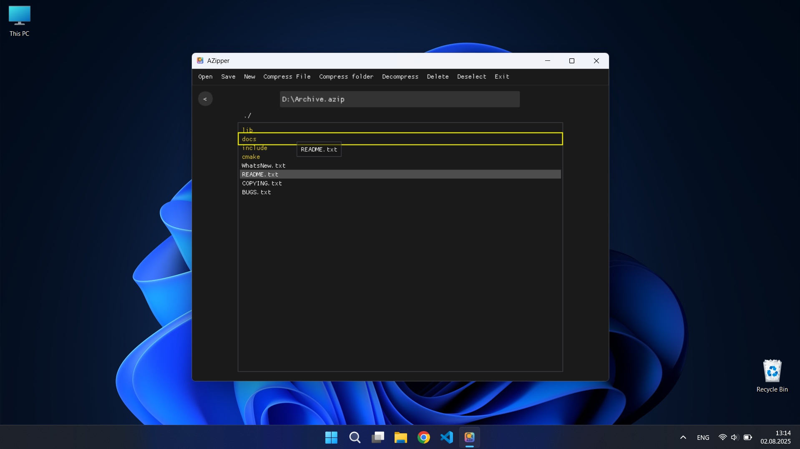

# AZipper

AZipper is a desktop application for Windows, written in C++, that allows compression and decompression of files and folders using a technique similar to Deflate. The project provides a graphical interface built with SDL2 and ImGui, enabling users to manage custom `.azip` archives. With this application, users can create, edit, and explore archives, having full control over their contents, offering a compresion ratio close to that of standard ZIP files.

## 🛠️ Main Features
- **Compress files and folders** into .azip format
- **Selective decompression** – choose which files or folders to decompress
- **Insert, delete, and move files** directly within the archive
- **View archive structure** – navigate folders and files
- **Progress bar** for all operations performed in the application
- **Intuitive graphical interface** with drag & drop and multi-selection
- **Open files** directly from the archive
- **Archive corruption detection**

## 📸 Screenshots
<table>
  <tr>
    <td align="center">
      <b>Layout</b><br>
      
    </td>
    <td align="center">
      <b>Drag & Drop</b><br>
      
    </td>
  </tr>
  <tr>
    <td align="center">
      <b>Progress Bar</b><br>
      
    </td>
    <td align="center">
      <b>Unsaved Changes</b><br>
      
    </td>
  </tr>
  <tr>
    <td align="center" colspan="2">
      <b>Archive Corrupted</b><br>
      
    </td>
  </tr>
</table>

## 🗂️ Project Structure
- `AZipper.cpp` – graphical interface, main logic, UI events
- `Compresor/Compressor.cpp, .h` – compression/decompression, insert, delete, move files
- `Compresor/Globals.cpp, .h` – global variables, data structures (LZ77, HuffmanNode) used in compression/decompression algorithms
- `Compresor/Utils.cpp, .h` – utility functions for reading/writing/operating on buffers, hashing, file checking
- `imgui/` – ImGui UI library
- `SDL2/` – SDL2 graphics library

## ⚙️ Algorithms Used (Backend)
### LZ77
- Lossless compression algorithm, identifies repetitive sequences and encodes them efficiently.
- Uses search and lookahead buffers for space optimization and fast data processing.
- Converts the entire file into sequences (length, offset, character) as follows:
    - If there is no sequence of at least 3 identical characters in the already processed data starting at the current position, the current character is saved as **(0, 0, character)**
    - If such a sequence exists in the already processed data, it is saved as a triplet **(length, offset, '-')**, where length is the sequence length and offset is the distance to the match; the '-' character has no significance
- The maximum valid sequence length is **258** and the maximum offset is **32768**, these values being relevant for efficient Huffman encoding using extra bytes
- Tokens are saved in a file so they do not need to be reconstructed when saving the file using Huffman codes
- For each length, the frequency of the code associated with that length is saved (see table below) together with the frequency of each character in a single frequency table, and for each offset, the frequency of the code associated with that offset is saved (see table below)

|     Length code    |     Extra bytes needed     |         Value interval         |
|:------------------:|:---------------------------:|:-------------------------------:|
|      0 - 255       |             0               |         ASCII characters        |
|        256         |             0               |          End-of-block           |
|    257 - 264       |             0               |         Length 3 - 10           |
|    265 - 268       |             1               |         Length 11 - 18          |
|    269 - 272       |             2               |         Length 19 - 34          |
|    273 - 276       |             3               |         Length 35 - 66          |
|    277 - 280       |             4               |        Length 67 - 130          |
|    281 - 284       |             5               |        Length 131 - 257         |
|        285         |             0               |         Length 258              |

|      Offset code        |     Extra bytes needed     |         Value interval         |
|:---------------------:|:---------------------------:|:-------------------------------:|
|        0 - 3          |             0               |         Offset 1 - 4            |
|        4 - 5          |             1               |         Offset 5 - 8            |
|        6 - 7          |             2               |         Offset 9 - 16           |
|        8 - 9          |             3               |         Offset 17 - 32          |
|       10 - 11         |             4               |         Offset 33 - 64          |
|       12 - 13         |             5               |        Offset 65 - 128          |
|       14 - 15         |             6               |        Offset 129 - 256         |
|       16 - 17         |             7               |        Offset 257 - 512         |
|       18 - 19         |             8               |       Offset 513 - 1024         |
|       20 - 21         |             9               |      Offset 1025 - 2048         |
|       22 - 23         |            10               |      Offset 2049 - 4096         |
|       24 - 25         |            11               |      Offset 4097 - 8192         |
|       26 - 27         |            12               |     Offset 8193 - 16384         |
|       28 - 29          |            13               |    Offset 16385 - 32768         |

> For lengths and offsets, the Huffman code determines the interval, and extra bytes complete the exact value. Literals (0-255) have no extra bytes, and end-of-block (256) marks the end of a data block.

### Huffman & Canonical Huffman
- Creates short binary codes for frequent data, reducing file size.
- Canonical coding allows fast and reconstructible decoding.
- For each frequency table, a Huffman tree is generated from which the Huffman code length for each code associated with that literal/length and offset is extracted
- Using that length, a Canonical Huffman code is created for each code associated with that literal/length and offset, which will be used in file encoding
- Canonical Huffman codes are used instead of basic ones to save only the code length for each literal/length and offset, not the entire code, resulting in fewer bytes written to the compressed file and correct data decompression
- Each token is read from the temporary file and processed as follows:
    - If the token represents a single character, i.e. (0, 0, character), the Canonical Huffman code associated with that character is saved in the compressed file and the next token is processed
    - If the token is of the form (length, offset, character), the Canonical Huffman code associated with that length + the extra bytes used for decompression (see table above) are saved, and then the offset is saved in the same way
- Each file encoding ends with the Canonical Huffman code of the special end-of-block character, which marks the end of the file encoding

### `.azip` Archive Structure
- For each file to be compressed in the archive, the length of the file/folder name is saved, the name itself using ASCII codes, and then a bit representing whether the name is a file or folder (0 for folder and 1 for file). For each folder, its name is saved, then all file names in that folder, and then exiting the folder is marked by a file name length of 0
- After all file/folder names are written, for each file:
    - the number of Canonical Huffman codes used for compressing literals/lengths is saved
    - for each literal/length, the code associated with each literal/length is written, then the Canonical Huffman code length
    - the same is done for offsets
    - for each LZ77 token, the associated codes + extra bytes are written where applicable, and at the end of each compressed file, the end-of-block code marks the end of the file
- All data is saved in MSB-to-LSB format

### The data compression and organization method is similar to that used in DEFLATE, which can be found [here](https://www.rfc-editor.org/rfc/rfc1951)


## 🚀 Download the application: [HERE](https://github.com/AndreiGhiorghies/AZipper/releases/download/v1.0.0/AZipper.exe)

## 🖥️ Requirements
- Windows
- C++17+
- SDL2 version 2.26.5-VC: [Download here](https://github.com/libsdl-org/SDL/releases?page=5)
- ImGui: [Download here](https://github.com/ocornut/imgui)

## 🔧 Compilation
Compilation command:
```bash
g++ AZipper.cpp Icon/icon.o imgui/imgui.cpp imgui/imgui_draw.cpp imgui/imgui_widgets.cpp imgui/imgui_tables.cpp imgui/backends/imgui_impl_sdl2.cpp imgui/backends/imgui_impl_opengl3.cpp Compresor/Compressor.cpp Compresor/Utils.cpp Compresor/Globals.cpp -I./SDL2/include -Iimgui -Iimgui/backends ./SDL2/lib/x64/SDL2.lib -lcomdlg32 -lopengl32 -lole32 -luuid -lcomctl32 -static -static-libgcc -static-libstdc++ -mwindows -o AZipper.exe
```

## 📄 License

Open-source project under the MIT license.
